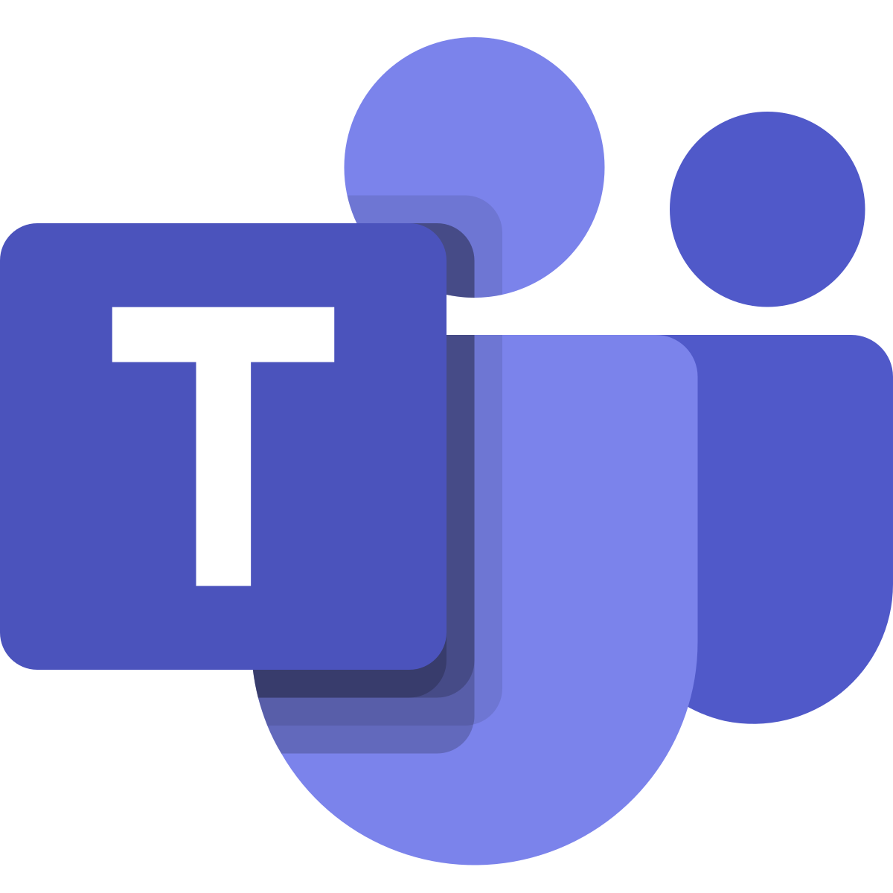

<link rel="stylesheet" href="style.css">

<link rel="preload" as="style" href="https://cdnjs.cloudflare.com/ajax/libs/font-awesome/5.13.0/css/all.min.css" onload="this.onload=null;this.rel='stylesheet'">
<link rel="preload" as="style" href="https://cdnjs.cloudflare.com/ajax/libs/font-awesome-animation/0.2.1/font-awesome-animation.min.css" onload="this.onload=null;this.rel='stylesheet'">

<h1 id="user" align="center"><a href="#wechat" ><i class="far fa-user-circle fa-2x faa-float animated faa-slow"></i></a></h1>

<i class="far fa-check-circle faa-tada animated faa-slow"></i>  A distinguished thought leader with a deep understanding of the startup ecosystem and practical experience with investment and incubation. Lead a knowledgeable and energetic open source organization that is responsible for ensuring that FOSS are successful all over the world.

<i class="far fa-check-circle faa-tada animated faa-slow"></i> Communicating original ideas to help guide entrepreneurs to successfully build lasting businesses. Have a deep and expansive network of relationships with existing venture capital firms, startup accelerators and incubators. Love to share unlimited potential with others and exhibit good judgment in selecting strategic opportunities to do so.

<i class="far fa-check-circle faa-tada animated faa-slow"></i> Unbridled passion and enthusiasm for business and technical innovation with expert domain knowledge about how early stage companies can become successful organizations. Help startup founders hone their strategy, select appropriate technology, scale their business and overcome the common hurdles faced by new companies.

 <i class="far fa-check-circle faa-tada animated faa-slow"></i> Entrepreneurial drive, demonstrated ability to achieve stretch goals in an innovative & fast paced environment and ship full life cycle products & services on time. Cogent problem solving skills, unique ability to make decision from pieces of factors.

 <i class="far fa-check-circle faa-tada animated faa-slow"></i> Rich experience of influencing, negotiating, coaching and mentoring skills. Extensive and in-depth knowledge of business development; high-level consulting and advising; superior decision-maker and high-tech evangelist, build-up & maintain high-performance teams effectively.

---

<h1 align="center"><i class="fa fa-id-card faa-shake animated-hover faa-slow"></i> Experience</h1>

##  Founder of TMT VC/PE & President of Apache A.I. Gluon

<i class="fas fa-map-marker-alt fa-fw"></i> Seattle, WA / Beijing • 2015 - Present

### <i class="far fa-id-badge fa-lg fa-fw faa-passing animated faa-slow"></i> Angel Investor & Incubator | President of Apache Software Foundation [Gluon](https://gluon.mxnet.io/)
<p align="right"><i class="fas fa-quote-left faa-shake animated faa-slow"></i> A clear, concise, simple yet powerful & efficient API for Apache MXNet & Microsoft CNTK.</p>
<p align="right"> <b>GluonCV Toolkit</b> - state of the art deep learning algorithms in Computer Vision (CV)</p>
<p align="right"> <b>GluonNLP Toolkit</b> - state of the art deep learning algorithms in Natural Language Processing (NLP)</p>

<h3 align="center"><i class="fas fa-tasks fa-fw fa-lg"></i></h3>

| **Open AI development - Apache unified API library across A.I. frameworks** |

>#### Flexible, Imperative Structure: Gluon does not require the neural network model to be rigidly defined, but rather brings the training algorithm and model closer together to provide flexibility in the development process.
>#### Dynamic Graphs: Gluon enables developers to define neural network models that are dynamic, meaning they can be built on the fly, with any structure, and using any of Python’s native control flow.
>#### High Performance: Gluon provides all of the above benefits without impacting the training speed that the underlying engine provides.
 
| **Investment, Consulting, Research & Analysis** |

>#### Start-up incubation and investment focused on VR/AR/MR, A.I, Blockchain and Healthcare - TMT related innovative cutting-edge projects. 
>#### Providing high-end industry consulting & management service for our investment portfolio such as Sunrise Calendar, Api.ai, X.ai, AIMatter, Cycle Computing, SambaNova, OnScale, BotChain, Platform.sh, Kaggle, Vertex.ai, Drive.ai, Healthcare.ai, Lobe.ai, Bonsai.ai, Bitfusion, Apex.AI, Builder.ai AmpereComputing etc. 

| **Healthcare Exploration, Medical Diagnosis** |

>#### In particular, interdisciplinary examination through cross industry resource integration in the field of medicine and healthcare.
>#### Accelerating early research and development of drugs experimentation and creation; medical imaging analytics, prediction, rapid screening as an application-oriented one-stop solution for clinical exploration.

---

## <i class="fab fa-fantasy-flight-games fa-lg faa-pulse animated faa-slow"></i> Duokoo Inc.

<i class="fas fa-map-marker-alt fa-fw"></i> Beijing • 2012 - 2015

### <i class="far fa-id-badge fa-lg fa-fw faa-passing animated faa-slow"></i> Founder, CEO

<p align="right"><i class="fas fa-quote-left faa-shake animated faa-slow"></i> NTT Docomo, Japan & Baidu jointly established mobile business company</p>

>#### Fully in charge of mobile music, reading, and gaming service; in collaboration with Baidu, bring Docomo wireless operating & management experience and resource into China emerging mobile entertainment and content creation, consumption & distribution market.

***

## <i class="fas fa-shield-alt fa-lg faa-pulse animated faa-slow"></i> TrustGo Mobile Corp.

<i class="fas fa-map-marker-alt fa-fw"></i> Menlo Park, CA / Beijing • 2010 - 2012

### <i class="far fa-id-badge fa-lg fa-fw faa-passing animated faa-slow"></i> Co-Founder, CTO & CPO

World leading mobile app search & security solution provider. 
<p align="right"><i class="fas fa-quote-left faa-shake animated faa-slow"></i> Unified Security, Comprehensive Protection. Trust & Go!</p>

>#### We seamlessly tie mobile security and secured app search & discovery together ingeniously to find apps cross global app-stores effortlessly.

***

## <i class="fab fa-google fa-lg faa-pulse animated faa-slow"></i> Google Inc.

<i class="fas fa-map-marker-alt fa-fw"></i> Mountain View, CA • 2005 - 2010

### <i class="far fa-id-badge fa-lg fa-fw faa-passing animated faa-slow"></i> General Manager

<i class="fab fa-product-hunt fa-fw fa-lg fa-spin"></i> Android OS | <i class="fab fa-product-hunt fa-fw fa-lg fa-spin"></i> Chrome OS

### <i class="far fa-id-badge fa-lg fa-fw faa-passing animated faa-slow"></i> Director of Product Management

<i class="fab fa-product-hunt fa-fw fa-lg fa-spin"></i> Google Earth | <i class="fab fa-product-hunt fa-fw fa-lg fa-spin"></i> Youtube


>#### Drive overall strategy and execution. Direct management of Product, Engineering and Operations; coordinate efforts with dedicated Marketing, Business Development.


><i class="fas fa-stream"></i> Initiating new products, services and solutions to meet existing or anticipated potential market needs; perform engineering process to make sure to meet business imperatives, quantify the progress and track schedule & delivery workflow. Manage different teams to approach the same target.

><i class="fas fa-stream"></i> Work cross functionally with colleagues from marketing, business etc, drive product development from conception to release. Define & ship the complex, multi disciplinary, and geographically scattered project design, development and implementation through end-to-end iterative release cycles.

><i class="fas fa-stream"></i> Planning, motivating and managing a widely dispersed groups, validate alignment with global business requirements and compliance with guidelines and policies. Executing with feasibility analysis accompanying risk evaluation. Launch, delivery & publish services in time & efficiently.

***
## <i class="fab fa-microsoft fa-lg faa-pulse animated faa-slow"></i> Microsoft, Global R&D Center

<i class="fas fa-map-marker-alt fa-fw"></i> Redmond, WA / Beijing • 2000 – 2005

### <i class="far fa-id-badge fa-lg fa-fw faa-passing animated faa-slow"></i> Principal Development Manager

<i class="fab fa-product-hunt fa-fw fa-lg fa-spin"></i> Lync Server | <i class="fab fa-product-hunt fa-fw fa-lg fa-spin"></i> SQL Server | <i class="fab fa-product-hunt fa-fw fa-lg fa-spin"></i> Office

>#### Lead a couple of development engineering teams to design & develop new features of next generation great product; SQL Server Analysis & Reporting Service & SSMS, Lync SDK and communication protocol, compression & encryption toolkit research; Office 2003 Wave 11 OpenXML format engine design.


><i class="fas fa-stream"></i> Working throughout the product life-cycle from conception through introduction to evolution, guiding the team development process to ensure the quality of deliverables.

><i class="fas fa-stream"></i> Demonstrate excellent communication skills spanning deep technical details to high-level overviews, code review & drive rapid iteration of development cycles, and creating solid code base.

><i class="fas fa-stream"></i> Managing several engineering teams, owing design process, work together across the teams to address all the issues either happened in the field or hidden in the product.

---
<h1 align="center"><i class="fas fa-ellipsis-v faa-bounce animated faa-slow"></i> Professional Details</h1>

### <i class="fas fa-user-check fa-2x faa-tada animated-hover"></i> Skills

```
☁️ Cloud: Microsoft Azure, Amazon AWS, Google Cloud Platform, Docker Container & Microservices, Kubernetes, Docker Swarm, Apache Mesos, Serverless Computing, Deep Learning, A.I.
📊 Big Data: HDInsight, Hadoop Spark, MapReduce, BigQuery, SQL Data Warehouse, Redshift, Data Analytics & Visualization, Power BI, SSAS, SSRS, SSIS
📜 Certification: PMI’s PMP|PfMP, Microsoft MCSD/MCSE/MVP of Developer, National Advanced Programmer
```
### <i class="fas fa-user-graduate fa-2x faa-tada animated-hover"></i> Education

```
📚 PhD, B.S. in Computer Science at Stanford University
📈 EMBA at Wharton School, University of Pennsylvania
```
### <i class="fas fa-swimmer fa-2x faa-tada animated-hover"></i> Interests

```
💻 Technologist, Social fanatics
📖 Reading book, Swimming
🤾 Fishing, Play football
```

<h3 id="wechat" align="center">
 
<a id="im" ></a>

<a href="https://teams.microsoft.com/l/channel/19%3a920fae62420149ecb9e7a1e9a2eb621d%40thread.skype/General?groupId=d7b09469-2abb-4078-b2dd-e4ea0cdc4a28&tenantId=cffff7eb-7f81-41a8-a586-0cd0d3cc8810" ></a>
 
<a href="https://join.skype.com/ki3n1R3VKh0K" ></a>

<a href="#user" ></a>

</h3>

<script>
function ios() {
  var ua = navigator.userAgent;
  var scheme = ua.indexOf("iPhone")> -1 ||ua.indexOf("iPad")> -1 || ua.indexOf("iPod")> -1 ? "sms:" : "imessage://";
  document.getElementById('im').href=scheme + "me@larry.ml"
}

window.onload = ios;
</script>
